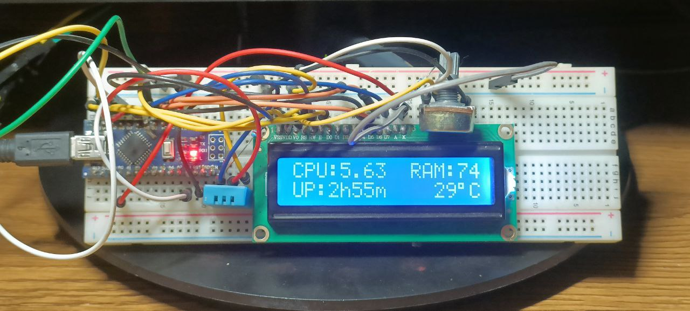

# Arduino PC Stats Monitor / Dynamic Ambient light

This project uses an Arduino board to interface with a PC and display various system stats on an LCD screen. The arduino also has an RGB LED for dynamic ambient lighting (to be placed behind or around the monitor on a desk) and lights up according to the average colour on the screen.

## Hardware Requirements

- Arduino board (tested with Arduino Nano)
- LCD screen (tested with 16x2 LCD screen)
- Jumper wires
- USB cable
- DHT11 Temperature sensor
- An RGB LED
- Potentiometer

## Software Requirements

- PlatformIO
- Visual Studio 2022 (Only works on Windows)

## Installation and Usage

1. Connect the LCD screen to the Arduino board using jumper wires. Refer to the pinout diagram for your specific LCD screen model.

2. Connect the Arduino board to your PC using a USB cable.

3. Open the `Arduino` folder in PlatformIO.

4. Build and upload the sketch to the Arduino board.

5. Open `Windows/Arduino.sln` in Visual Studio and Build and run the program

6. The C++ code should connect to the Arduino through the serial port.

## License

This project is licensed under the MIT License. See the `LICENSE` file for details.
